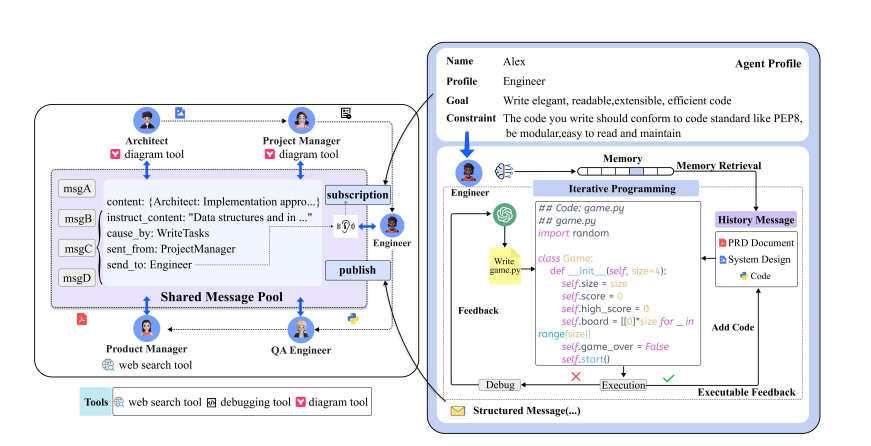
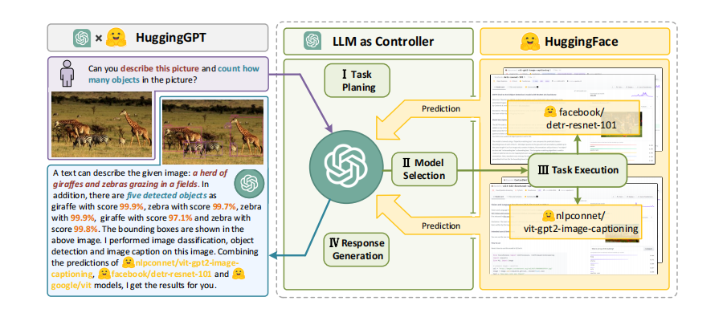

- 同样，我们使用Metagpt文档中对于Agent的描述进行总结与展开
	- `Agent = Large Language Model (LLM) + Observation + Thought + Action + Memory`
	- `Agent = 大语言模型（LLM） + 观察 + 思考 + 行动 + 记忆`
- 我们不从复杂的抽象概念来理解这部分的描述
- 而是以我们自己作为一个人类来理解这部分
	- `大语言模型(LLM)=我们的大脑`
	- `观察=我们的眼睛或者耳朵`
	- `思考=我们大脑来觉得通过观察得到的信息该如何处理`
	- `行动=思考结束，我们根据思考结果来进行相对应的行为`
	- `记忆=保留这次的行动过程 or 结果`、
- 例子 我很胖，我要减肥。
	- `大语言模型(LLM)=我们的大脑`
	- `观察=感受到请求，我要减肥`
	- `思考=如何减肥`
		- 节食？->思考结果：节食的减肥不健康
		- 良好的作息？->可行
		- 运动？ -> 可行->如何运动?->经过再次思考->觉得跳绳不错->决定每周跳1000次绳
		- 良好的饮食习惯？->可行->xxxxxxx
		- 以上的行为，即为我们人类的计划**plan**
	- `行动=思考结束，进行运动，按时休息与良好的饮食习惯`
	- `记忆=保存我们整个的思考过程与结果`、
- 在这里，对于人类来说，执行上面的行为是非常简单的，思考过程也相对简单。
- 对于大模型来说，基于现有数据内容进行检索预测，按照上面的流程基本上也可以完成对应的减肥动作。
- 这就是一个可以帮助你减肥的AI智能体
- 而多智能体就是将思考过程拆碎，良好的作息由一个agent负责定制，运动内容由一个agent来定制，良好的饮食习惯由一个agent来负责定制，他们共同有的就是你的身高，体重。甚至如果你不知道自己想减多少斤，你可以再创建一个agent来分析根据你的身高，年龄你应该减到多少斤。
- 以上就是Agernt的内容。
-
- 思考与拓展：
- 在听过metagpt作者分享后 https://www.bilibili.com/video/BV1Ru411V7XL/?spm_id_from=333.337.search-card.all.click&vd_source=199360a57d436da9caa4d615e469c770
- 笔者读了metagpt与HuggingGPT的相关论文。
- metagpt agent 多智能体图示
- 
- huggingGpt：
- 
- 这里两者在代码中实现多智能体的方式是差不多的(个人理解)，均是制定plan->拆分task->按顺序执行task->收集最终结果
- huggingGpt是由gpt来做中心大脑，链接不同大模型的大脑来完成需求，更像是一个多模态结果。
- 而metagpt是由单一大模型来做不同角色的大脑，由不同角色来共同完成一个复杂的需求。更像是解决单一工业流程的
- **还没读metagpt最新的0.6代码，之前0,4的代码也只是粗略的过了一遍，但觉得在metagpt中植入多模态功能制作huggingGpt的效果来说并不复杂，这样对于metagpt的agent感知来说，数据来源就更加的多样化了，可以将多套SOP合并为一个复杂的SOP，美术SOP+程序SOP+市场SOP=软件公司**
-
- **立个flag，尝试增加一套美术流程(虽然我不懂美术，毕竟程序不懂审美),先把metagpt的代码精度一遍之后再做，代码写的很好，python入门必看！**
-
-